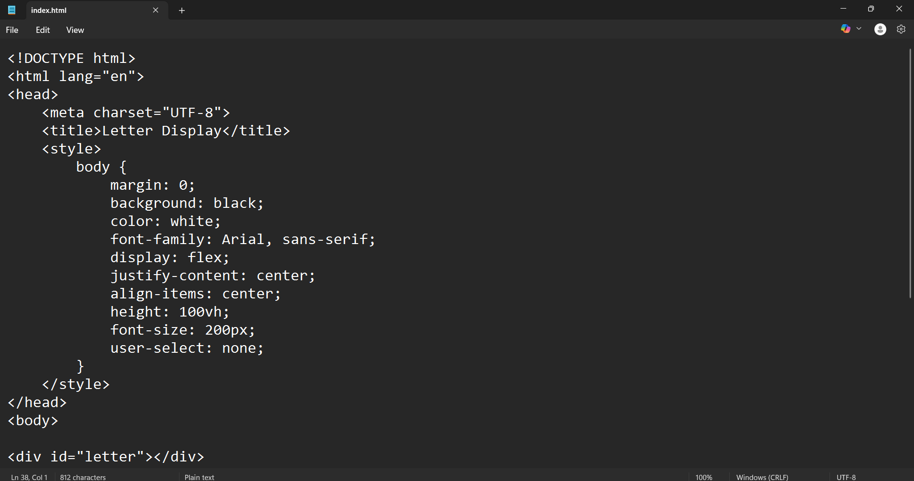

# Steps to Use the Letter Display Website

## Step 1: Create the Website

Create a new file named **index.html** and add the website content inside it.

## Step 2: Open the Website

Open the `index.html` file in any browser such as Chrome, Edge, or Firefox.

## Step 3: Enter a Letter
Press any alphabet key on your keyboard.  

The letter you press will appear in the middle of the website in a large size.  

Only the latest letter will be shown each time you press a key.

